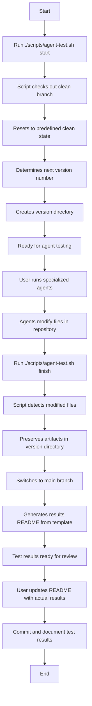

# Agent Testing Project

This is a comprehensive testing framework designed to evaluate and demonstrate the capabilities of specialized AI coding agents. What started as a simple "vibe coding" experiment to test if agent invocation was working properly has evolved into a robust benchmarking tool for AI-assisted development.

Originally created for Qwen Code's subagent team, this project provides a standardized environment for testing agent performance across multiple dimensions:

1. Code Reviewer
2. Security Code Reviewer
3. Testing Expert
4. Documentation Writer

## The Origin Story

This project began as a humble exploration - a "vibe coding" session where we simply wanted to see if we could get specialized agents to work together effectively. What started as an experimental playground to test the basic functionality of agent invocation has grown into a comprehensive framework for evaluating AI coding assistants.

The beauty of this project lies in its simplicity. We created an intentionally flawed authentication service with deliberate code quality and security issues, providing a realistic environment for testing agent capabilities. Through iterative experimentation and refinement, we discovered that this simple approach could effectively reveal the strengths and weaknesses of different AI agents.

## Project Structure

- `src/` - Source code directory containing the mock authentication service
- `tests/` - Test files for the authentication service
- `docs/` - Documentation files, including API documentation generated by agents
- `test-results/` - Versioned test results and documentation organized by test iteration
- `scripts/` - Automation scripts for consistent testing workflows
- `package.json` - Project configuration and dependencies
- `CHANGELOG.md` - Project change history and version tracking

## Test Scenarios

1. **Code Reviewer**: Review the authentication service for general code quality
2. **Security Code Reviewer**: Review the authentication service for security vulnerabilities
3. **Testing Expert**: Create unit tests for the authentication service
4. **Documentation Writer**: Create API documentation for the authentication service

This project is intentionally simple but contains enough complexity to thoroughly test all agent capabilities, including their ability to identify security vulnerabilities, code quality issues, and generate comprehensive documentation and tests.

## Test Results

Test results are stored in the `test-results/` directory, organized by version:

- `test-results/v1/` - First comprehensive test using general-purpose agents for simulation (September 2025)
- `test-results/v2/` - Second comprehensive test using actual specialized agents (September 2025)

**Important**: The v1 test used general-purpose agents to simulate our specialized agents rather than invoking the actual agent files directly. The v2 test used actual specialized agents. For detailed information about the test results and methodology, see `test-results/v1/README.md` and `test-results/v2/README.md`.

Each test version directory contains a README.md file that summarizes the results and methodology of that particular test trial, along with preserved artifacts in the `artifacts/` subdirectory.

## Using This Framework with Other AI Coding Assistants

This testing framework can be adapted for other AI coding assistants with minimal modifications (Qwen Code, Claude Code, OpenAI Codex, Gemini CLI, OpenCode, etc.). The key is to provide each AI assistant with clear role definitions, specific instructions, and access to appropriate tools for each specialized task.

## Automated Testing

We provide an automation script to simplify the testing workflow:

```bash
# Start a clean testing environment
./scripts/agent-test.sh start

# After testing, prepare for results documentation
./scripts/agent-test.sh finish
```

The script automatically handles version numbering and artifact preservation, ensuring consistent testing conditions for each evaluation.

### Testing Workflow

The following diagram illustrates the complete testing workflow when using our automation script:



This workflow ensures:
1. **Consistency**: Each test starts from exactly the same clean state
2. **Isolation**: Test artifacts are preserved separately for each version
3. **Documentation**: Results are automatically templated for consistent reporting
4. **Reproducibility**: The exact same setup can be recreated for verification

## Contributing

We welcome contributions to expand this testing framework for additional AI coding assistants, add new test scenarios, or improve the existing evaluation criteria. Please feel free to fork this repository and submit pull requests with your enhancements.
